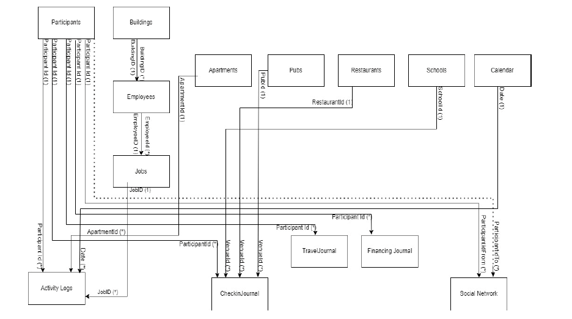
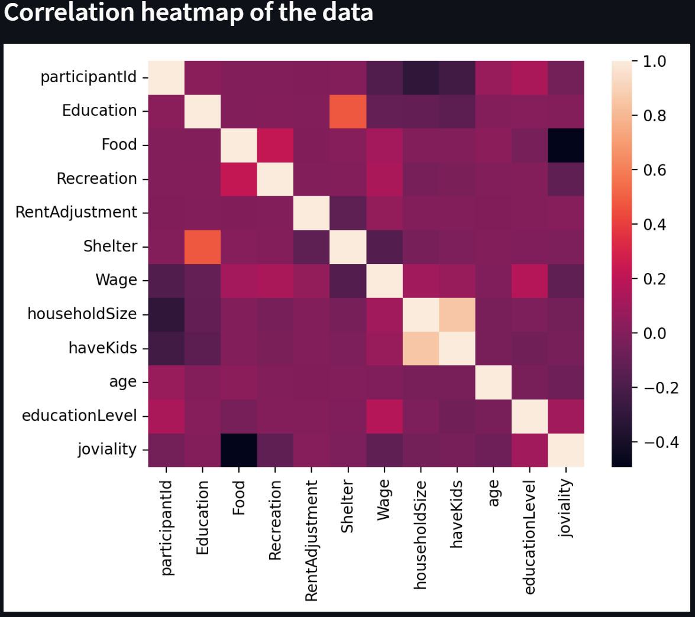
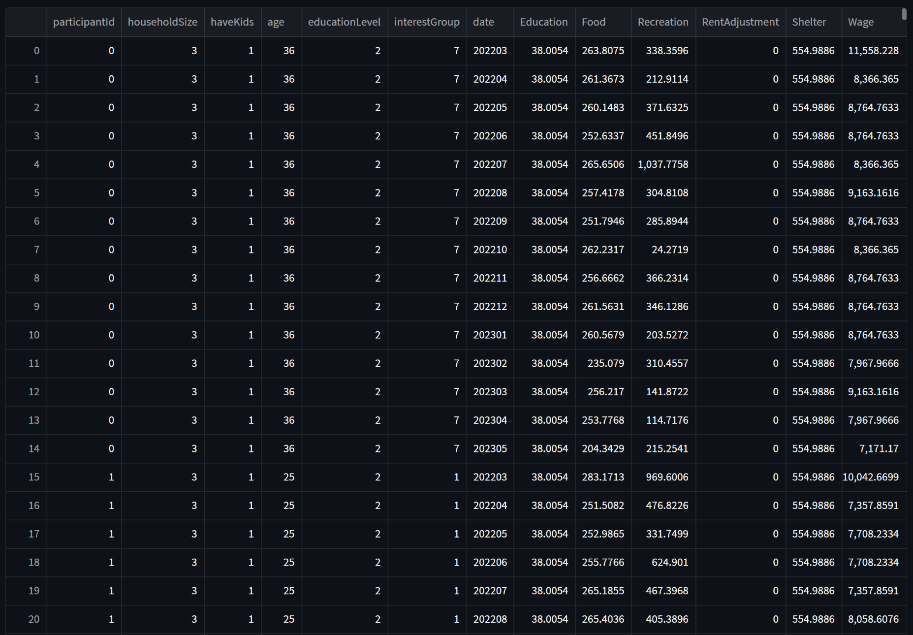
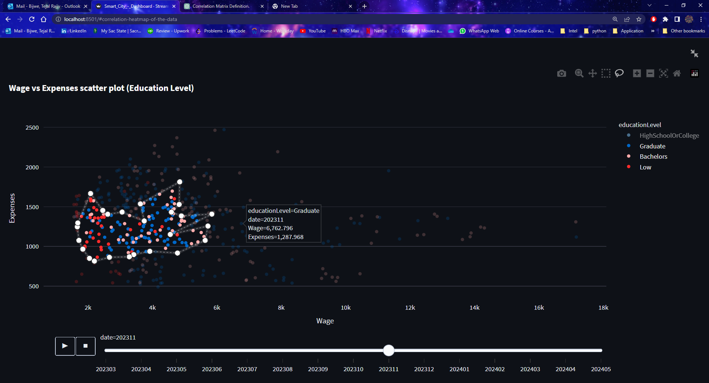

# Data Visualization of City Economy

## Project Overview
This project focuses on visualizing and analyzing urban data to provide insights into a city's economic trends. By leveraging machine learning models and data visualization techniques, it aims to aid decision-making for city planning, resource allocation, and economic forecasting.

## Features
- **Interactive Dashboard**: A web-based visualization tool built with Streamlit.
- **Data Analysis**: Uses Pandas and NumPy for data preprocessing.
- **Machine Learning Models**: Predicts financial trends using Random Forest Regression and Classification.
- **Data Visualization**: Implements Matplotlib, Seaborn, and Plotly for insightful graphical representations.
- **Smart City Insights**: Helps in identifying financial stability, expenses, wages, and trends for future planning.

## Technologies Used
- **Programming Languages**: Python, HTML, CSS
- **Libraries & Frameworks**: Pandas, NumPy, Matplotlib, Seaborn, Scikit-learn, Plotly, Streamlit
- **Tools**: Visual Studio Code

## Installation
To set up and run the project, follow these steps:

1. **Clone the repository:**:
   ```bash
   git clone https://github.com/your-repo-name.git
2. **Navigate to the project directory:**:
   ```bash
   cd your-repo-name
3. **Install dependencies:**:
   ```bash
   pip install -r requirements.txt
3. **Run the application:**:
   ```bash
   streamlit run app.py

## Usage
- Open the dashboard in your browser.
- Interact with visualizations to analyze different economic parameters.
- Use machine learning predictions to forecast financial trends.

### Relation Among Datasets
This visualization illustrates the interconnections between various datasets, demonstrating how different factors contribute to the city's financial health.

### Correlation Heatmap of Data
The heatmap visually represents the correlation between different features, helping identify patterns and dependencies in the dataset.

### Curated Data Along with the Calculated CAGR
This screenshot displays the curated dataset with the calculated Compound Annual Growth Rate (CAGR), which helps forecast economic trends. 

### Wages and Expenses Scatter Plot
A scatter plot showcasing the relationship between wages and expenses among participants, segmented by categories such as education level and age group.

## Future Enhancements
- Integration of geospatial data for regional financial insights.
- Improved ML models for better accuracy.
- Expansion to include more economic indicators.
  
